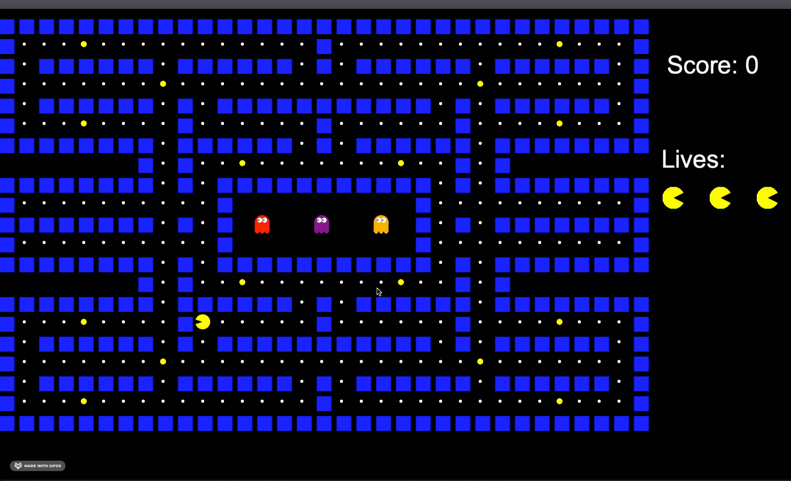

# Pacman
A version of Pacman made using Cinder and C++

## Demo 


### Dependencies
The only dependency required is Cinder. If you're on Windows, you may need Microsoft Visual Studio 2017 in order to be compatible with Cinder. 

### Installing
To install Cinder, visit https://libcinder.org/download and download it for your OS. Once downloaded, clone this repo 
and go into the ```CMakeLists.txt``` file and change ```line 48``` to point to location where you have Cinder downloaded 

Everything else will be handled by the CMake file. Once you clone the repo, make sure to load the CMake file. 

Alternatively, you can run it from the command line through the commands

```cd into project directory```

```cmake ..```

```cd apps && make cinder_app_main```

### The game
The game follows the rules of Pacman. There will be periods of time where the ghosts are chasing you followed by periods of time where the ghosts are scattered to the corners of the map. Your objective is to eat all the dots on the screen. You have 3 lives. You can also eat the power ups that will allow you to eat the ghosts.
#### Keyboard controls

| Key       | Action                                                      |
|---------- |-------------------------------------------------------------|
| `Right arrow`       | Move to the right                                           |
| `Left arrow`       | Move to the left                                            |
| `Up arrow` | Move up                                                        |
| `Down arrow`       | Move down                                         |
| `q`       | Quit the game    |
                                        
